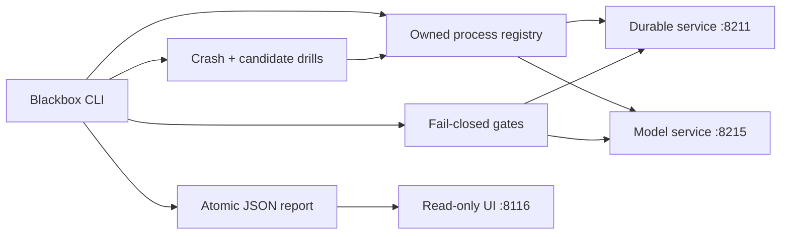

# Blackbox: release reliability lab

Blackbox is a local release gate and failure-testing product for the portfolio services. One command launches real service processes against isolated temporary state, runs health and API contract probes, applies bounded concurrent load, interrupts an owned process, rejects a broken model candidate, restores the last-known-good model artifact, and writes an inspectable evidence report. A read-only web UI on port 8116 turns that report into an incident and release timeline.

The final integration path exercises `durable-workflows` and `model-lifecycle-service` from their own repositories. A separately labeled fixture mode keeps this repository runnable when those sibling repositories are unavailable; fixture results are never presented as actual-service evidence.



## Quick start

Requirements are Python 3.12+, `uv`, and `make`.

```bash
make setup
make test
make demo
make report
```

Open [http://127.0.0.1:8116](http://127.0.0.1:8116) after `make report`.

`make demo` uses reserved integration ports 8211 and 8215, never the portfolio demo ports 8111 and 8115. It refuses to start if either integration port is already occupied. The command creates a temporary SQLite database and copies the bundled model registry into temporary known-good and candidate directories. Those directories are removed after every run.

For a standalone fixture run:

```bash
uv run reliability-lab run \
  --mode fixtures \
  --durable-port 8211 \
  --model-port 8215 \
  --load 12 \
  --output artifacts/fixture-run.json
```

For real services in a different checkout:

```bash
uv run reliability-lab run \
  --mode actual \
  --durable-repo /absolute/path/to/durable-workflows \
  --model-repo /absolute/path/to/model-lifecycle-service \
  --durable-port 8211 \
  --model-port 8215 \
  --load 12 \
  --output evidence/latest-run.json
```

Each dependency repository must already have its own `.venv` from `uv sync --frozen`. The lab records each dependency's exact Git revision and dirty-tree state before it launches anything.

## Gates and drills

The durable gate requires the exact health identity and version, creates a strictly shaped import with the synthetic Alpha bearer credential, reads it back, and confirms the Beta credential receives 404. The interruption drill initially disables workers, creates a persisted queued job, sends `SIGKILL` only to the lab-owned child process group, observes an unreachable health endpoint, and restarts the same revision with workers against the same isolated database. The queued job must then succeed.

The model gate requires the expected health identity and `wine-logreg-v1`, sends all 13 bounded numeric features through `/predict`, verifies the returned model version and probability sum, and applies concurrent prediction load. The candidate is the actual model service pointed at a copied registry whose active release refers to a missing artifact. Non-200 health closes the gate. Rollback stops that candidate, launches the actual model service against the unchanged copied last-known-good registry, and re-runs health plus prediction. The report records the registry content hash before and after.

Rollback here means the known actual model release artifact is restored and verified after a candidate release fails. It is more than restarting the same broken configuration. It does not represent traffic switching on a production load balancer or database rollback.

Process ownership is fail-closed: the registry signals only child process names it started, uses separate process groups, and rejects unknown names. Cleanup runs in `finally` before temporary state is deleted. No `pkill`, wildcard kill, external container, cloud resource, or shared database is used.

## Commands and evidence

```bash
uv sync --frozen
uv run ruff check .
uv run pytest
make demo
make benchmark
make report
```

`make benchmark` repeats the actual integration with 40 requests per service and writes `evidence/benchmark.json`. Reports distinguish actual and fixture modes, record action duration and outcomes, include short incident writeups, measured load observations, source and dependency revisions, conditions, and limitations. Draft claims live in `evidence/claims.json` and remain pending user wording and mastery review.

The tests cover wrong-version and unhealthy fail-closed gates, refusal to signal an unowned process, cleanup isolation, atomic report replacement, the report API, a full fixture run, and a real candidate rejection plus last-known-good rollback when the sibling model repository is available.

## Tradeoffs and limits

- This is a local process orchestrator, not a production deployment controller. It has no remote hosts, container scheduler, service discovery, TLS, or multi-user control plane.
- Port preflight reduces accidental interference but cannot eliminate a bind race with an unrelated process.
- HTTP checks use explicit timeouts and no environment proxy. Load measurements are small local observations and do not establish capacity or an SLO.
- The durable crash drill proves process outage, recovery, and isolated state persistence. It does not simulate disk loss or multi-node failover.
- Model rollback restores a copied known-good artifact registry. It does not roll back application code, schema migrations, or production traffic.
- Child logs live only in the temporary run directory and are deleted after the structured report is written; the report records actions and failures without importing private data.

## License and data

This repository and its synthetic fixtures are MIT licensed. It imports no private data. Actual runs use the sibling projects' original synthetic/import values and bundled Wine teaching-dataset model under the licenses documented by those repositories.

